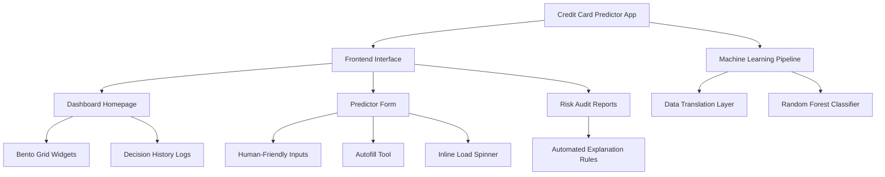

# Brainstorming & Ideation Notes

## 1. Project Conception
During the initial planning phases, the team focused on bridging the gap between statistical model building and real-world deployment. Machine learning models often live inside Jupyter Notebooks as static code. The goal of this brainstorming phase was to conceptualize a production-ready application around a trained classifier.

## 2. Target Personas
To design the application features, the team brainstormed two primary user personas:

### Persona A: The Loan Underwriter (Internal User)
- **Goals:** Quickly review incoming applications, check the reasoning behind automated decisions, and verify that applicant metrics meet internal guidelines.
- **Pain Points:** Hard-to-read model outputs, lack of transparency in "black-box" models, and slow manual data entry.
- **Required Features:** Detail-rich risk audit reports, access to past decision logs, and clean layout structures (Bento Grid) that highlight critical information first.

### Persona B: The Direct Applicant (External User)
- **Goals:** Submit demographic information and get an instant estimation of eligibility.
- **Pain Points:** Confusing terminology (e.g. entering negative days instead of age in years) and lack of feedback on rejection reasons.
- **Required Features:** Human-friendly fields, client-side input validations, and inline loading indicators to manage expectations during processing.

## 3. Core Feature Wishlist
The brainstorming sessions resulted in the following high-priority feature list:

1. **Multi-Page Interface:** Split the site into home dashboards, predictor forms, and technical documentation page setups instead of a single page layout.
2. **Translation Layer (Human-to-Model):** A backend preprocessor that translates inputs like "Age (35 years)" or "Years of Employment (5)" to negative days automatically, keeping the model happy while simplifying user input.
3. **Dynamic Unemployed View:** Automatically hide/disable duration inputs if the applicant checks the "Unemployed" box, avoiding user error.
4. **Interactive Audit Reports:** Avoid simple "Yes/No" answers. The interface should explain *why* the decision was reached (e.g. checking if annual income is above standard thresholds or if the applicant has steady employment history).
5. **Autofill Utility:** A button to generate random applicant data instantly to make testing and demonstration fast.

## 4. Architectural Feature Map
The brainstormed feature groups and their relationships are modeled below:

