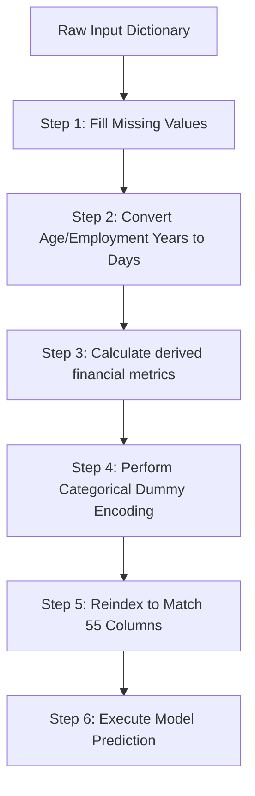

# Pipeline Design & Processing Steps

This document outlines the step-by-step data transformations applied to raw user inputs before they are passed to the machine learning classifier.

---

## 1. Step-by-Step Data Flow

---

## 2. In-Depth Step Explanations

### Step 1: Fill Missing Values
- **Logic:** The dataset contains missing values, primarily in the `OCCUPATION_TYPE` column.
- **Handling:** Missing occupations are filled with the string `"Unknown"`. This prevents Pandas operations and model prediction functions from raising null-value exceptions.

### Step 2: Convert Age & Employment Years to Days
- **Logic:** The trained models require inputs in the form of days (measured as negative integers representing days before the current date). However, the frontend collects user-friendly values in positive years.
- **Formulas:**
  - Age conversion:
    $$\text{DAYS\_BIRTH} = -\text{floor}(\text{AGE\_YEARS} \times 365.25)$$
  - Employment conversion:
    - If the applicant is flagged as "Unemployed", their duration is set to the default sentinel value `365243`.
    - Otherwise, duration is calculated as:
      $$\text{DAYS\_EMPLOYED} = -\text{floor}(\text{YEARS\_EMPLOYED} \times 365.25)$$

### Step 3: Derived Financial Features
- **Logic:** Calculate custom metrics to capture the relationship between income and career length.
- **Metric:** `INCOME_EMPLOY_RATIO`
  - Measures the ratio of annual income to years employed.
  - Formula:
    $$\text{INCOME\_EMPLOY\_RATIO} = \frac{\text{AMT\_INCOME\_TOTAL}}{\text{YEARS\_EMPLOYED}}$$
  - If the applicant is unemployed (years employed is 0), the ratio defaults to the applicant's full `AMT_INCOME_TOTAL`.

### Step 4: Categorical Dummy Encoding
- **Logic:** The classifier cannot process raw categorical strings (e.g. `Income Type = 'Working'`). These must be transformed into numeric features.
- **Method:** One-hot encoding is applied using `pd.get_dummies()`. This expands the categorical features (like family status, housing style, and education) into binary columns (0.0 or 1.0).

### Step 5: Column reindexing & Alignment
- **Logic:** One-hot encoding a single row can lead to different numbers of columns depending on the categories selected. The classifier expects a fixed input shape of exactly 55 features.
- **Method:** The DataFrame is aligned using `.reindex(columns=feature_columns, fill_value=0.0)`. Any missing dummy columns are filled with `0.0`, ensuring the feature vector matches the model's training configuration.
