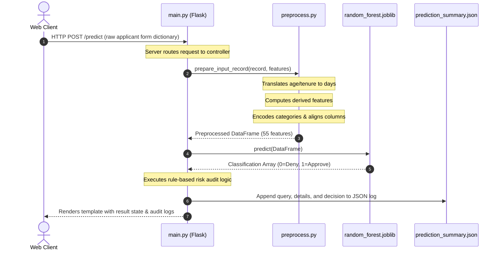

# System Architecture & Design

This document details the modular layout, system components, file locations, and architectural patterns implemented in the Credit Card Approval Prediction application.

---

## 1. Modular Directory Breakdown

The application maintains a separation of concerns between raw Python execution, model storage, presentation templates, and persistent data logging.

```dir
credit-card-approval-prediction/
│
├── main.py                          # Application entry point and route controller
├── Dockerfile                       # Container deployment definition
│
├── app/                             # Core backend logic
│   ├── __init__.py                  # Package initialization
│   └── preprocess.py                # Pipeline preprocessing and feature alignment
│
├── frontend/                        # Jinja2 layout templates
│   ├── base.html                    # Layout structure, global CSS styling, and navigation
│   ├── index.html                   # Bento dashboard homepage
│   ├── predict.html                 # Form predictor & inline risk report view
│   └── docs.html                    # Tech specs and exploratory analysis charts
│
├── static/                          # Static assets served by Flask
│   └── assets/                      # Curated images and exported visualization charts
│
├── models/                          # Serialized classifier pipelines
│   ├── random_forest.joblib         # Production-ready classifier
│   └── predictions/                 # Directory containing prediction logs
│       └── prediction_summary.json  # Historical log of evaluations
```

---

## 2. Component Design & Responsibilities

### 2.1 Presentation Layer (Jinja2 Templates)
- **Role:** Handles layout structure, responsive grids, user interaction, and data presentation.
- **Key Modules:**
  - `base.html`: Provides styling configurations (using Outfit font and a dark neon color palette) and shared navigation elements.
  - `predict.html`: Manages the prediction form state. Features client-side JavaScript to hide employment fields if "Unemployed" is checked. Displays an inline progress status state machine during submissions.

### 2.2 Backend Application Controller (`main.py`)
- **Role:** Handles incoming HTTP routes, manages session logs, handles JSON input requests, and generates risk audit logs.
- **Design Pattern:** Singleton Loader pattern. The application loads the `random_forest.joblib` binary model once into server memory on launch, avoiding slow reload times on subsequent user requests.

### 2.3 Data Transformation Layer (`app/preprocess.py`)
- **Role:** Houses the `prepare_input_record` function. Transforms raw input maps (dictionary format) into a structured Pandas DataFrame.
- **Responsibilities:** Imputing missing categorical occupations as "Unknown", translating user-entered years into day formats, one-hot encoding categories, and aligning columns to match the 55 trained variables.

---

## 3. Data Flow & Interaction Pipeline

The diagram below details the path of an applicant's data from web input to the finalized risk audit output.


